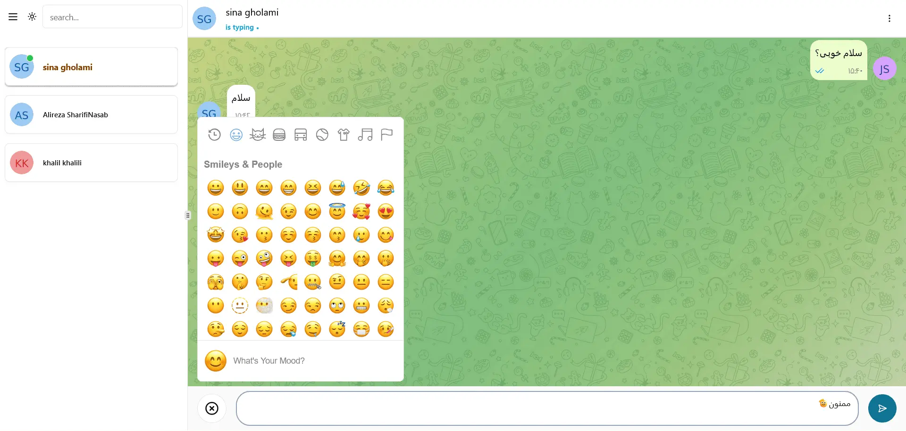
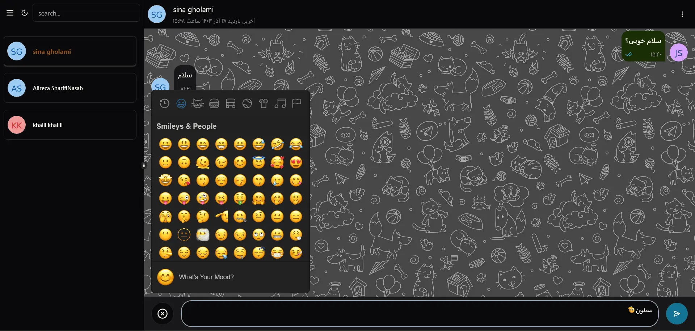

# 🚀 Chat Room Project

Welcome to the **FullStack Chat Room Project**! This is a real-time chat application built with modern web technologies, enabling seamless communication between users. Dive into the codebase or spin up the project to see it in action! 🌟

---

## 📸 Screenshots

## 




---

## 🛠️ Features

- **Real-Time Communication**: Powered by Socket.IO for instant messaging.
- **Responsive UI**: Built with React and TailwindCSS for a sleek and adaptive design.
- **Authentication**: Secure user login and session management.
- **Emoji Support**: Add fun to your messages with the emoji picker! 😄
- **Theme Customization**: Switch between light and dark themes effortlessly.
- **Database-Driven**: PostgreSQL with Drizzle ORM for robust data management.

---

## 🏗️ Tech Stack

### Frontend

- **React**: Core framework for building the user interface.
- **TailwindCSS**: For beautiful and customizable styles.
- **Socket.IO Client**: Enables real-time communication.
- **TypeScript**: Ensures type safety and better development experience.

### Backend

- **Node.js & Express**: Backend framework for handling server logic.
- **Socket.IO**: Real-time WebSocket communication.
- **Drizzle ORM**: Simplifies database queries with PostgreSQL.
- **JWT**: Secure authentication and authorization.
- **bcryptjs**: Password hashing for secure storage.

---

## 🚀 Getting Started

### Prerequisites

Ensure you have the following installed:

- **Node.js**: v16 or later
- **PostgreSQL**: Database for storing chat data
- **npm** or **yarn**: Package manager

### Installation

1. Clone the repository:

   ```bash
   git clone https://github.com/alirezashn79/chat-room.git
   cd chat-room
   ```

2. Install dependencies for both frontend and backend:

   ```bash
   cd front
   npm install
   cd ../back
   npm install
   ```

3. Set up environment variables:

   - Copy `.env.example` to `.env` in the `back` directory.
   - Add your database credentials, JWT secret, and other configs.

4. Initialize the database:

   ```bash
   npm run generate
   npm run migrate
   ```

### Running the Application

- **Frontend**:
  ```bash
  cd front
  npm run dev
  ```
- **Backend**:
  ```bash
  cd back
  npm run dev
  ```

Visit `http://localhost:3000` to see the app in action! 🎉

---

## 📂 Project Structure

### Frontend (`front`)

- `src/components`: Reusable UI components
- `src/pages`: Page-level components
- `src/hooks`: Custom React hooks
- `tailwind.config.js`: TailwindCSS configuration

### Backend (`back`)

- `src/routes`: API endpoints
- `src/db`: Database schemas and migrations
- `src/middleware`: Authentication and error handling

---

## 🤝 Contributing

We welcome contributions! Follow these steps:

1. Fork the repository.
2. Create a new branch: `git checkout -b feature-name`.
3. Commit your changes: `git commit -m 'Add new feature'`.
4. Push to the branch: `git push origin feature-name`.
5. Open a pull request.

---

## 📜 License

This project is licensed under the **ISC License**. Feel free to use, modify, and distribute as needed.

---

## 🧑‍💻 Author

**Alirezashn79**\
Feel free to reach out for any questions or collaboration opportunities! ✨

---

## 🌟 Acknowledgments

Thanks to all the contributors and the open-source community for their amazing work! 🙌
